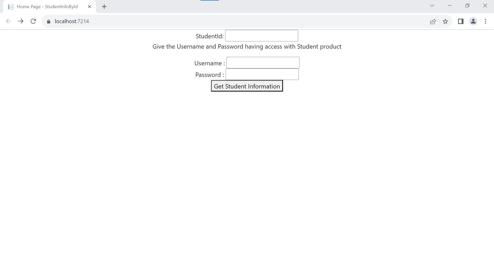
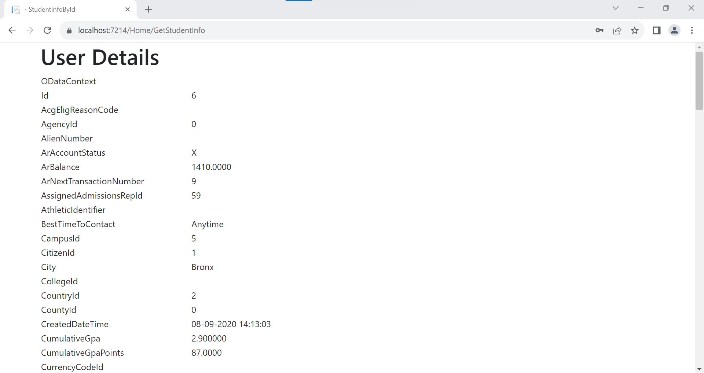

# Fetch the student information based on given Id.

## Description
This project involves an api and a web application . from these we can fetch the student information based on the student ID.

## Installation
[Microsoft Visual Studio](https://visualstudio.microsoft.com/)

## Usage [steps to run the project]
- After installing Visual studio, Open the StudentInfoById.sln file which resides in `src` folder.
- Just run the project by clicking on run button.
- Enter Student Id in rendered html form.
- Enter Username and password.

